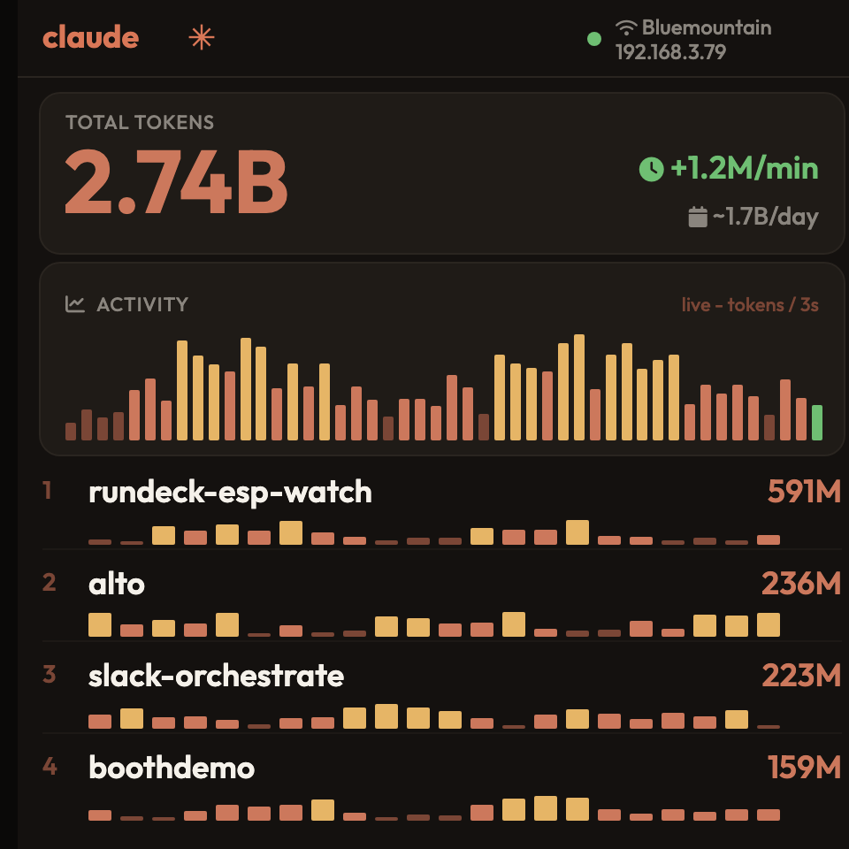

# claudemon

Wireless token-usage monitor for Claude Code, running on the **Sunton
ESP32-4848S040C** (480×480 capacitive CYD, ESP32-S3 N16R8).



A host-side tailer watches `~/.claude/projects/*/*.jsonl`, aggregates token
usage per project, and POSTs deltas to the device over the LAN. The device
shows a live "Pulse" dashboard:

- animated **total tokens** with a count-up
- **per-minute** rate and a projected **per-day** rate
- a heat-coloured **activity graph** that scrolls on a 3-second cadence
- the **top projects** ranked, each with its own 60-minute sparkline
- Outfit + FontAwesome icons, Claude wordmark header, coral-on-charcoal theme

## Flash it (no toolchain)

**Easiest — web installer.** Open **https://justynroberts.github.io/claudemon/**
in Chrome or Edge, plug the device in over USB, and click *Install*. No tools to install.

**Command line.** Download `claudemon-full.bin` from
[Releases](https://github.com/justynroberts/claudemon/releases) and flash at `0x0`:

```bash
pip install esptool
esptool.py --chip esp32s3 --port <PORT> --baud 460800 write_flash 0x0 claudemon-full.bin
# or, from a clone:  ./scripts/flash.sh claudemon-full.bin
```

**From source** (developers) — see *Build from source* below.

## Layout

```
boards/                 Sunton board JSONs (git submodule, pinned)
include/lv_conf.h       LVGL 9 config
platformio.ini          env, toolchain pins, build flags
src/
  main.cpp              boot sequence + core-1 loop (LVGL + touch)
  config.{h,cpp}        NVS persistence (WiFi + shared secret)
  net.{h,cpp}           core-0 task: AP/STA state machine, DNS, mDNS, HTTP
  portal.{h,cpp}        captive-portal HTML form (network scan + secret)
  httpsrv.{h,cpp}       shared WebServer instance
  store.{h,cpp}         per-env aggregates, model rollups, 60-min ring
  touch.{h,cpp}         GT911 threshold fix + manual click dispatch
  theme.h               colour palette
  ui.{h,cpp}            LVGL screens (AP splash + Pulse dashboard)
  fonts/                generated LVGL fonts + logo (+ sources, regen README)
host/
  claudemon-tailer.py   host-side log tailer
  README.md             tailer setup + launchd autostart
scripts/
  serial_capture.py     reset + capture serial (pio monitor needs a TTY)
DEVELOPMENT.md          architecture + how to build more on this device
DEVICE_NOTES.md         hardware bring-up (panel, GT911, toolchain)
CLAUDE.md               boot order + recurring gotchas
```

## Build from source

```bash
git submodule update --init      # pulls boards/
pio run -t upload                # build + flash over USB
./scripts/build-release.sh       # produce dist/claudemon-full.bin (single-file image)
```

> The first boot right after a flash may fail the initial WiFi associate (cold
> RF) and recover on the next reset/power-cycle.

## First boot

1. Device comes up in AP mode: SSID `claudemon-XXXX`, password `claudemon`.
2. Join it; a captive-portal page appears. Pick your network and enter the password.
3. Copy the **shared secret** shown on the form — the tailer needs it.
4. Device reboots into STA mode; the dashboard serves at `http://claudemon.local`.

## Desktop tailer (feed it data)

The device shows nothing until something feeds it usage. A small tailer watches
your Claude Code logs and pushes deltas to the device.

**One-step install (macOS)** — sets up config, checks the device is reachable, and
installs a `launchd` agent that auto-starts at login and restarts on crash:

```bash
./host/install.sh        # asks for device URL + the secret from the setup page
./host/uninstall.sh      # remove it later
```

It deliberately runs under Apple's `/usr/bin/python3`, which has macOS 15 Local
Network access (a Homebrew python gets `No route to host` to LAN devices even though
`curl` works). The bundled config parser means no `pip install` is needed.

**Manual / other platforms:**

```bash
/usr/bin/python3 host/claudemon-tailer.py   # writes default config, exits
$EDITOR ~/.config/claudemon/tailer.toml     # set device_url + shared_secret
/usr/bin/python3 host/claudemon-tailer.py   # runs continuously
```

The token store is RAM-only, so it starts empty on each boot and fills as you work.

## Re-entering setup

Long-press the screen for ~3 s — wipes saved WiFi and drops back to AP mode.

## Before changing the toolchain

Read `CLAUDE.md` and `DEVICE_NOTES.md` before touching `platformio.ini`, the
GT911 setup, or the LVGL wiring — there are days of pinned hardware/toolchain
quirks documented there. For everything else (architecture, adding UI, fonts,
icons, host endpoints), see `DEVELOPMENT.md`.
